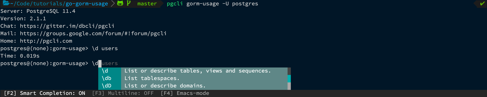
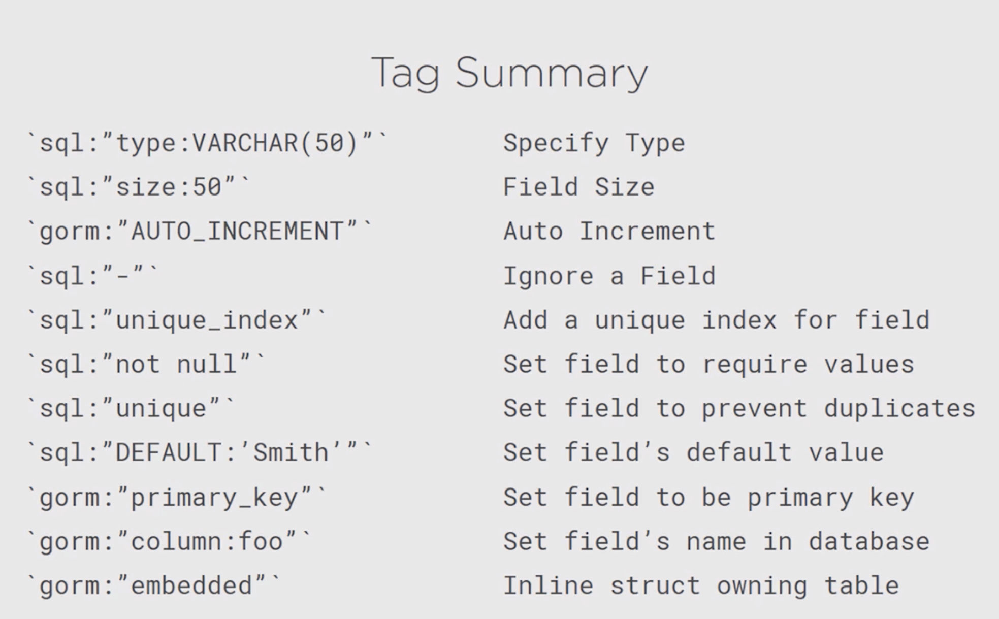
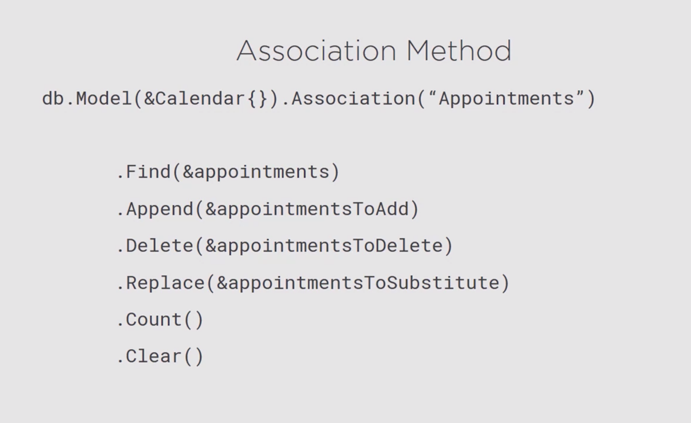

# go-gorm-usage

### Requirements

1. [Install postgres](https://www.postgresql.org/download/)
2. Create a user named "postgres" (no password required)

   ```
   createuser postgres
   ```

3. Create a database named "gorm-usage"

   ```
   createdb gorm-usage
   ```

4. Install [pgcli](https://www.pgcli.com/) for better tooling.

## Examples

Use the repository's Makefile to run examples.

Commit messages use Angular commit messages enforced by [commitizen-go](https://github.com/lintingzhen/commitizen-go). So make sure to read them for documentation.

To see the changes for a given an example run:

`pgcli gorm-usage -U postgres`



### Basics

<details>
  <summary>See commands</summary>

```makefile
make connection # connect to database
make table # create database table
make model # create gorm.Model
make record # create database record
make fields # create table fields with specified type and size
make increment # create auto incrementing field
make transient # create temporary field
make query # query "first" or "last" name (e.g., make query query=last)
make update # perform record update
make delete # delete record
make unique # create unique field
make index # create unique index
make required # disable null fields
make default # provide default field value
make primary # create primary key
make rename_column # rename column
make embedding # embedd child objects
make index_call # call index and remove index functions
```



</details>

### Relationship

<details>
  <summary>See commands</summary>

```makefile
make one_to_one # make a one to one relationship
make foreign_key # make foreign key constraint and cascade the record on delete/update
make one_to_many # make a one to many relationship
make many_to_many # make a many to many relationship
make polymorphic # make polymorphic relationship
```

Gorm also allows you to make assiociations bewteen tables using
the association accessor methods, meaning you aren't limited to
just using gorms conventions or struct tags.

[See Associations](https://gorm.io/docs/associations.html)



</details>

### CRUD

<details>
  <summary>See commands</summary>

```makefile
make create_task
make update_task
make update_columns
make batch_update
make delete_task
make transactions
```

</details>

### Querying the database

<details>
  <summary>See commands</summary>

```makefile
make find
make where_clauses
make eager_loading
make limits_orderby_offset
make subsets
make attribute_assignments
make joins
make rows
make grouping
make raw_sql
```

</details>

### Modifing Schemas

<details>
  <summary>See commands</summary>

```

```

</details>

### Advanced Topics

<details>
  <summary>See commands</summary>

```

```

</details>
